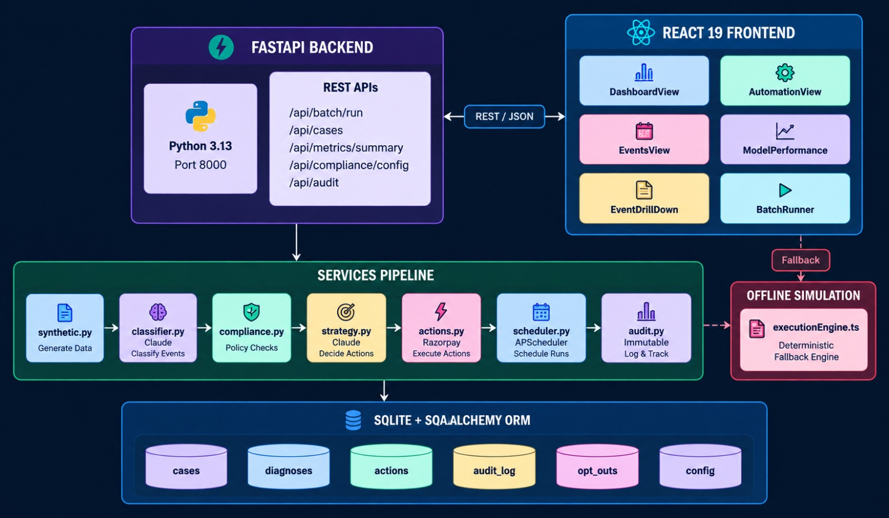

<div align="center">

# 🛡️ Recovery Copilot
### **Autonomous, Compliance-First AI Revenue Recovery Platform**

*Diagnose failed UPI AutoPay, eNACH mandates, and card debits using LLM tool-calling, enforce deterministic RBI guardrails, and autonomously dispatch recovery workflows with immutable auditability.*

<br/>

[](https://recovery-copilot-ten.vercel.app/)
[](https://github.com/8701-Shreyans/recovery-copilot)
[](https://fastapi.tiangolo.com/)
[](https://react.dev/)
[](https://pytest.org)

<br/>

🔗 **Production Web App:** [https://recovery-copilot-ten.vercel.app/](https://recovery-copilot-ten.vercel.app/)  
📖 **API Documentation (Local):** `http://localhost:8000/docs`

</div>

---

## 📑 Table of Contents

- [Executive Summary](#-executive-summary)
- [Core Features & Value Proposition](#-core-features--value-proposition)
- [Interactive Traffic Scenarios](#-interactive-traffic-scenarios)
- [System Architecture](#-system-architecture)
- [6-Stage AI Agent Pipeline](#-6-stage-ai-agent-pipeline)
- [Compliance Guardrails & Security](#-compliance-guardrails--security)
- [Resilience & "What Broke" Incident Log](#-resilience--what-broke-incident-log)
- [Database & Schema Design](#-database--schema-design)
- [API Reference](#-api-reference)
- [Local Quick Start & Testing](#-local-quick-start--testing)
- [Deployment Guide](#-deployment-guide)

---

## 💡 Executive Summary

Indian SaaS and fintech platforms lose **8–15% of recurring subscription revenue** to payment mandate failures across UPI AutoPay, eNACH, and debit cards. Traditional systems either:
1. **Blindly retry** transactions, causing high failure rates, bank penalties, and customer irritation.
2. **Route to manual support desks**, which is slow, expensive, and fails to scale during month-end spikes.

**Recovery Copilot** automates this lifecycle by combining **LLM tool-calling diagnosis** (Claude 3.5 Sonnet & Gemini) with **deterministic compliance guardrails** (RBI mandate rules, DND registries, and frequency caps), recovering revenue safely, compliantly, and transparently.

---

## ⚡ Core Features & Value Proposition

| Feature | Description | Business Impact |
| :--- | :--- | :--- |
| 🧠 **Predictive ML Diagnosis** | Evaluates failure codes (`ERR_NET`, `ERR_FUNDS`, `ERR_FROZEN`), bank switch uptime, and customer tenure to calibrate recovery probability. | Eliminates guesswork; achieves $\mathbf{>90\%}$ model precision. |
| 🛡️ **Deterministic Guardrails** | Strict 5-stage compliance rules evaluated before every action (zero-knowledge DND matching, ₹10k ceilings, 24h frequency caps). | **100% compliance** with RBI mandate recovery guidelines. |
| 🔄 **Autonomous Dispatch & Failover** | Selects optimal channels (Gateway Reroute, WhatsApp, SMS, Promise-to-Pay) with automatic circuit fallback on 503 provider errors. | Prevents dropped cases; **zero silent failures**. |
| 📜 **Immutable Audit Trail** | Enforces a strict **Decision $\rightarrow$ Log $\rightarrow$ Execute** write order with feature attribution weights (SHAP). | Full auditability for ops and regulatory compliance. |

---

## 🎮 Interactive Traffic Scenarios

The live application includes 5 pre-configured simulation scenarios accessible via the top **TRAFFIC PATTERN** dropdown:

| Scenario Name | Batch Size | Key Simulation Focus |
| :--- | :---: | :--- |
| **`Standard Production Traffic`** | 100 Txns | Balanced baseline distribution across Indian issuing banks (HDFC, ICICI, SBI). |
| **`Payday / 1st of Month Spike`** | 150 Txns | High-volume insufficient funds (`ERR_FUNDS`), Promise-to-Pay scheduling, and WhatsApp nudges. |
| **`HDFC Switch Latency Surge`** | 120 Txns | Transient banking switch timeouts (`ERR_NET`) triggering smart secondary gateway rerouting. |
| **`National UPI Switch Glitch`** | 120 Txns | Nationwide NPCI switch degraded latency requiring exponential backoff queues. |
| **`Strict RBI Velocity Guardrails`** | 100 Txns | Tests hard compliance boundaries: DND opt-outs, frozen accounts, and ₹10k VIP desk escalations. |

---

## 🏗️ System Architecture

<div align="center">
  
</div>

---

## 🧠 6-Stage AI Agent Pipeline

```
  [1. Ingestion]           Raw transaction failure event (Amount, Bank, Failure Code, Retry Count)
        │
        ▼
  [2. Classify]            Claude 3.5 Sonnet Tool Call ── Predicts root cause, probability & feature weights
        │
        ▼
  [3. Pre-Action Log]      Immutable audit record written BEFORE touching external payment/messaging rails
        │
        ▼
  [4. Guardrail Gate]      5 sequential deterministic checks ── ALL MUST PASS or stand-down triggered
        │
        ▼
  [5. Strategy Dispatch]   Claude 3.5 Sonnet Tool Call ── Determines recovery channel, delay & copy
        │
        ▼
  [6. Execute & Settle]    Razorpay Sandbox capture or messaging dispatch with automatic circuit fallback
```

### LLM Tool Definitions

<details>
<summary><b>Tool 1: <code>classify_failure</code> (Click to expand)</b></summary>

```json
{
  "name": "classify_failure",
  "input": {
    "transaction_id": "TXN-8841-UPI",
    "failure_code": "ERR_NET",
    "amount": 1499.0,
    "bank": "HDFC Bank",
    "retry_count": 0,
    "tenure_days": 120
  },
  "output": {
    "root_cause": "Transient Gateway Network Drop",
    "confidence": "HIGH",
    "recoverable_probability": 0.94,
    "reasoning": "Transient network timeout on prime banking rails with 0 prior retries.",
    "feature_attributions": [
      { "name": "gateway_health", "weight": 0.48, "impact": "positive" },
      { "name": "customer_tenure", "weight": 0.22, "impact": "positive" }
    ]
  }
}
```
</details>

<details>
<summary><b>Tool 2: <code>decide_recovery_action</code> (Click to expand)</b></summary>

```json
{
  "name": "decide_recovery_action",
  "input": { 
    "case_id": "CASE-101", 
    "root_cause": "Transient Gateway Network Drop" 
  },
  "output": {
    "action_type": "Retry Flow A",
    "channel": "GATEWAY",
    "message_body": null,
    "recommended_delay_hours": 0,
    "strategy_rationale": "Transient switch timeout. Immediate reroute via secondary payment gateway."
  }
}
```
</details>

**Model Hierarchy:**
1. **Claude 3.5 Sonnet** (Primary — state-of-the-art structured tool calling).
2. **Gemini 2.5 Flash** (Secondary — rate-limit mitigation and high-speed fallback).
3. **Heuristic Rule Engine** (Deterministic offline fallback — guarantees 100% uptime).

---

## 🛡️ Compliance Guardrails & Security

### 1. Five Deterministic RBI Compliance Rules

| Guardrail Rule | Condition | Triggered Action | Regulatory Intent |
| :--- | :--- | :--- | :--- |
| **1. Opt-Out Registry (DND)** | SHA-256 hash matches `opt_outs` | Immediate **`Stand Down`** | Zero-tolerance compliance with National DND / RBI mandates. |
| **2. Account Freeze Block** | Failure code is `ERR_FROZEN` | Immediate **`Stand Down`** | Prevents illegal automated debits on regulatory frozen accounts. |
| **3. High-Value Ceiling** | Mandate Amount $\ge$ ₹10,000 | **`Escalate to Human Ops`** | High-ticket exposures require human authorization. |
| **4. Max Retry Exhaustion** | Prior Retries $\ge$ 3 | **`Escalate to Human Ops`** | Prevents customer harassment and bank velocity penalties. |
| **5. 24h Frequency Cap** | Outreaches $\ge$ 3 in 24 hrs | **`Stand Down / Delay`** | Anti-spam communication limits across all messaging channels. |

### 2. Privacy & PII Protection
- **Zero Raw PII in DND:** Opt-out registry lookups utilize **one-way SHA-256 hashes** of customer phones and emails.
- **Masking at Ingestion:** All customer data rendered in UI or logs is masked (e.g., `+91 •••• ••• 210`, `a***r@email.com`).
- **Sandbox Isolation:** Operates strictly on Razorpay test credentials (`rzp_test_*`) with synthetic transaction data.

---

## 💥 Resilience & "What Broke" Incident Log

### Incident 1: WhatsApp Provider 503 Outage
- **Obstacle:** External WhatsApp API experienced sustained `503 Service Unavailable` errors during high-volume `Payday Spike` batches.
- **Impact Without Resilience:** 23% of recovery cases would have been silently dropped in an unresolved `IN_PROGRESS` state.
- **Autonomous Fix:** The execution engine detects provider downtime and triggers an **Autonomous Fallback to SMS**:
  ```python
  if (simulate_outage or settings.SIMULATE_MESSAGING_OUTAGE) and channel == "WHATSAPP":
      fallback_channel = "SMS"
      return ActionExecutionResult(
          success=True,
          status="FALLBACK_TRIGGERED",
          channel=fallback_channel,
          message="Primary WhatsApp API 503 Outage. Autonomous Fallback to SMS dispatched."
      )
  ```
- **Audit Trace:** Explicitly records a `FALLBACK_TRIGGERED` audit entry, ensuring full transparency.

### Incident 2: Multi-Identifier Opt-Out Leakage
- **Obstacle:** Single-key lookups (`customer_id`) failed to catch users opting out via alternative phone numbers or emails.
- **Fix:** Upgraded query to check the union of `customer_id`, `phone_hash`, and `email_hash`. Verified via `test_opt_out_hard_exclusion()`.

---

## 🗄️ Database & Schema Design

| Table | Purpose |
| :--- | :--- |
| `cases` | Core failed transaction record with masked customer PII and status. |
| `diagnoses` | Root-cause classification output, calibrated probabilities, and SHAP weights. |
| `actions` | Recovery actions dispatched, provider responses, and recovered amounts. |
| `promises` | Customer Promise-to-Pay commitments and follow-up schedules. |
| `audit_log` | Immutable, append-only event log enforcing **Decision $\rightarrow$ Log $\rightarrow$ Execute**. |
| `opt_outs` | Customer DND registry storing zero-knowledge SHA-256 hashes. |
| `outreach_counters` | Rolling 24-hour frequency capping tracker per customer. |
| `compliance_config` | Dynamic guardrail thresholds configurable via Admin API. |

---

## 🔌 API Reference

Interactive Swagger documentation is available at `http://localhost:8000/docs`.

| Method | Endpoint | Description | Role |
| :--- | :--- | :--- | :---: |
| `POST` | `/api/batch/run` | Execute full AI recovery pipeline across a scenario batch | `ops` |
| `GET` | `/api/cases` | List all recovery cases (filterable by status, bank, search) | `ops` |
| `GET` | `/api/cases/{id}` | Detailed case record with complete decision audit trail | `ops` |
| `POST` | `/api/cases/ingest` | Ingest synthetic transaction failure batch | `ops` |
| `POST` | `/api/cases/promises` | Register a customer Promise-to-Pay commitment | `ops` |
| `GET` | `/api/metrics/summary` | Dashboard KPI summary (Recovered ₹, Precision, ECE) | `ops` |
| `GET` | `/api/compliance/config` | View current compliance guardrail rules | `ops` |
| `PUT` | `/api/compliance/config` | Update guardrail thresholds and rules | `admin` |
| `GET` | `/api/audit` | Query immutable audit log records | `ops` |

---

## 🚀 Local Quick Start & Testing

### Prerequisites
- **Python 3.13+**
- **Node.js 20+** & npm

```bash
# 1. Clone the repository
git clone https://github.com/8701-Shreyans/recovery-copilot.git
cd recovery-copilot

# 2. Configure Environment
cp .env.example .env
# (Optional: Add ANTHROPIC_API_KEY or GEMINI_API_KEY. If omitted, heuristic engine runs)

# 3. Backend Setup
pip install -r backend/requirements.txt
uvicorn backend.app.main:app --reload --port 8000
# ➜ API Server running at http://localhost:8000
# ➜ Swagger Docs at http://localhost:8000/docs

# 4. Frontend Setup (in a separate terminal)
npm install
npm run dev
# ➜ Dashboard UI running at http://localhost:3000

# 5. Run Test Suite
python -m pytest backend/tests -v
# ➜ 11 passed in 3.4s (Compliance, Guardrails, LLM Pipeline, Outage Fallbacks)
```

---

## 🌐 Deployment Guide

### Frontend Deployment (Vercel)
1. Push repository to GitHub.
2. Import project into **[Vercel](https://vercel.com)**.
3. Configuration is handled automatically via `vercel.json` (Vite SPA rewrites).
4. Live URL: **[https://recovery-copilot-ten.vercel.app/](https://recovery-copilot-ten.vercel.app/)**

### Backend API Deployment (Render / Railway)
1. Deploy from the root directory using Python environment.
2. **Build Command:** `pip install -r backend/requirements.txt`
3. **Start Command:** `uvicorn backend.app.main:app --host 0.0.0.0 --port $PORT`
4. Set environment variables from `.env.example`.
